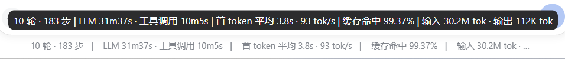

# DSH-Cache-Hit-Precision

**DSH 插件：让状态栏下方的缓存命中率显示两位浮点数**

## 📖 简介

它通过 dsh 的 slot 阴影机制包装原始 `StatsLine`，仅替换 `stats.cacheHit` 的本地化参数：从 `tokenUsage` 投影重新计算精确百分比，再以两位小数输出。

**效果：**



## ✨ 特性

- 非侵入：不修改 dsh 安装目录与任何上游包
- 原样保留统计行：轮次、步骤、耗时、TTFT、token 等显示均不变
- 自动跟随当前语言：中文 / English

## 🚀 快速开始

### GitHub 安装

```bash
dsh plugin --profile web add github:luern0313/DSH-Cache-Hit-Precision
# 安装后重启：
dsh web
```

### 本地安装

```bash
git clone https://github.com/luern0313/DSH-Cache-Hit-Precision.git
dsh plugin --profile web add ./DSH-Cache-Hit-Precision
# 安装后重启：
dsh web
```

### 手动安装（不使用 pnpm）

```bash
mkdir -p ~/.dsh/profiles/web/node_modules
ln -sfn /path/to/DSH-Cache-Hit-Precision ~/.dsh/profiles/web/node_modules/dsh-cache-hit-precision
```

然后在 `~/.dsh/profiles/web/cordis.patch.yml` 末尾追加：

```yaml
- insert:
    - id: cache-hit-precision
      name: dsh-cache-hit-precision
```

重启生效：

```bash
dsh web
```

## 🧩 工作原理

1. 找到 `conversation.composer.dock` 中 id 为 `stats`、优先级为 `0` 的原始统计行组件。
2. 以相同 id、更低优先级注册一个阴影组件。
3. 阴影组件渲染原组件，但拦截 `stats.cacheHit`：从 `tokenUsage` 重新计算缓存命中率，再格式化为两位小数。

## 📜 开源协议

MIT License
